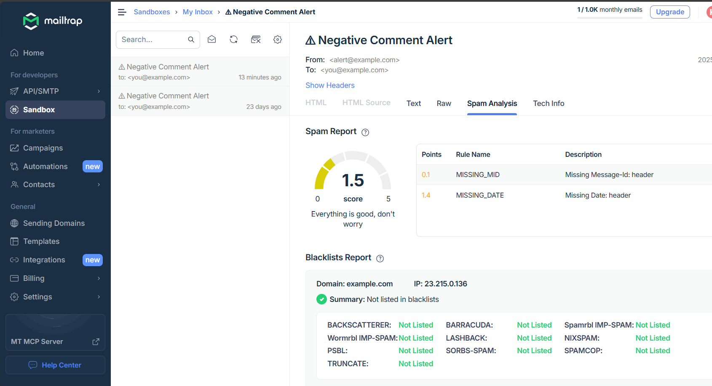

# 📧 Email Alert System using AI

This project is a simple AI-powered Python application that analyzes text messages using sentiment analysis and sends an email alert if a negative comment is detected. It can be used in feedback systems, support tickets, or anywhere monitoring user sentiment is important.

---

## 🚀 Features

- 🔍 Detects negative comments using pre-trained AI (DistilBERT)
- 📬 Sends automatic email alerts through SMTP (Mailtrap or Gmail)
- 🤖 Uses Hugging Face Transformers for sentiment analysis
- 🛠️ Fully customizable and beginner-friendly

---

## 🧠 Tech Stack

- 🐍 Python
- 🤗 Hugging Face Transformers
- ✉️ SMTP (Mailtrap or Gmail for testing)
- 🧑‍💻 VS Code (for development)

---

## ⚙️ Installation

Make sure you have Python 3 installed. Then install the required Python library:

```bash
pip install transformers
```

Or use a virtual environment:

```bash
python -m venv venv
source venv/bin/activate  # On Windows: venv\Scripts\activate
pip install transformers
```

---

## ✉️ Email Configuration

Open `email_alert.py` and update the following values:

```python
smtp_server = "smtp.mailtrap.io"       # Or "smtp.gmail.com"
smtp_port = 587
username = "your_smtp_username"
password = "your_smtp_password"
sender_email = "your@email.com"
receiver_email = "recipient@email.com"
```

✅ Tip: Use [Mailtrap](https://mailtrap.io) for SMTP testing.

---

## ▶️ How to Run

1. Open a terminal in your project directory
2. Run the script:

```bash
python email_alert.py
```

3. Enter a comment when prompted:

```
Enter a comment: This is horrible.
```

4. The script will detect sentiment and, if negative, send an email:

```
Sentiment: NEGATIVE (0.96)
📬 Email sent successfully!
```

---

## 📸 Output Screenshot

Below is an actual email preview from Mailtrap after a negative sentiment alert was sent:



---

## 🙋‍♀️ Author

**Charitha Kummari**  
🔗 GitHub: [@Kummaricharitha15](https://github.com/Kummaricharitha15)

---

## 🔗 Project Link

👉 [GitHub Repository](https://github.com/Kummaricharitha15/email-alert-project)
